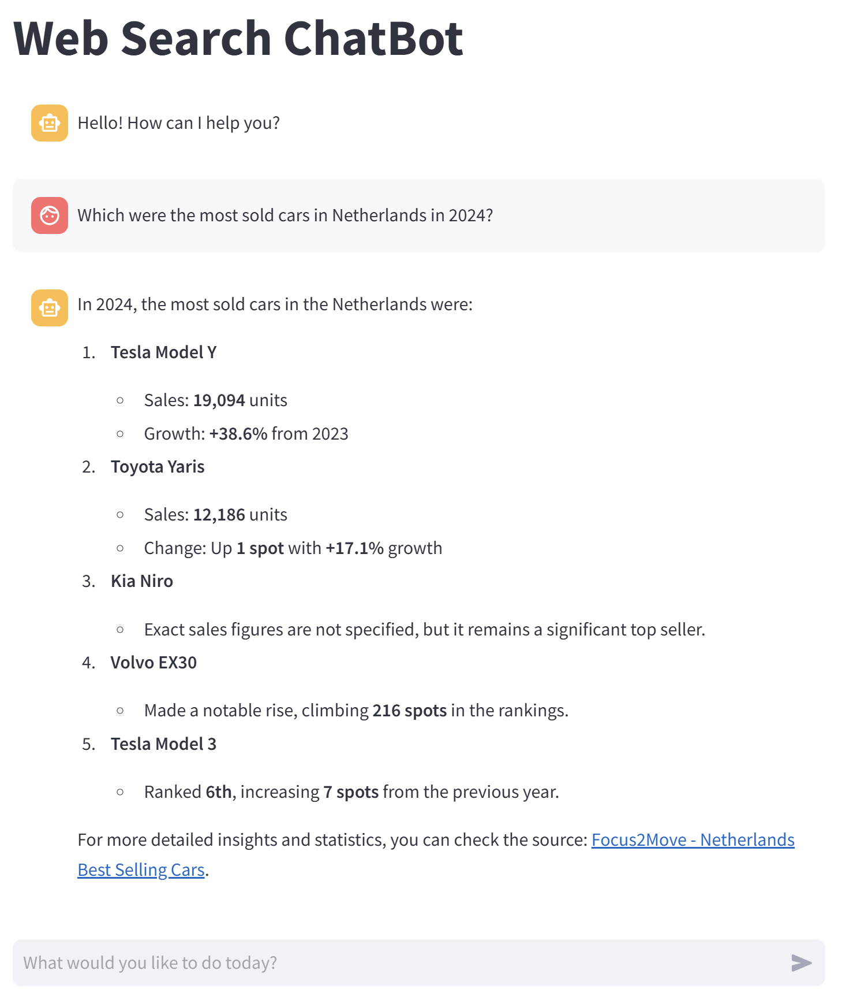

# Web Search Chatbot

## Overview
Web Search Chatbot is a multi-agent chat application that performs real-time web search and data crawling to provide up-to-date responses. It utilizes **LangGraph** for multi-agent architecture, **DuckDuckGo** for search, and **Crawl4AI** for web crawling. The chatbot intelligently refines search queries to deliver accurate answers.

### Install Dependencies
```sh
pip install -r requirements.txt
```

### Running the Chatbot

- **Note**: add your OpenAI API key to the `.env` file.

```sh
streamlit run ./src/app.py
```

<p align="center">
  
</p>
